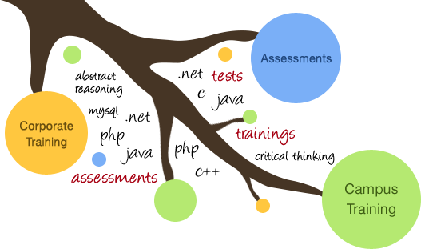

# Uni-Test #

[](https://github.com/conventional-changelog/standard-version)
[](https://github.com/tbaltrushaitis/uni-test/blob/master/LICENSE)
[](https://david-dm.org/tbaltrushaitis/uni-test)
[](https://github.com/tbaltrushaitis/uni-test/graphs/contributors)



Interactive assessment example

`test` `survey` `assessment`

---

## Live Demo ##

 [Competence assessment: Planning and organization](http://bit.ly/uni-test) :point_left:

---

## Setup ##

### Download ###

```shell
$ git clone https://github.com/tbaltrushaitis/uni-test.git && cd uni-test
```

### Install dependencies and build ###

```shell
$ make
```

Developed in **May 2014**

---

### :link: More Info ###

 - [GitHub / Basic writing and formatting syntax](https://help.github.com/articles/basic-writing-and-formatting-syntax/)
 - [BitBucket Markdown Howto](https://bitbucket.org/tutorials/markdowndemo)
 - [Creating an Automated Build](https://docs.docker.com/docker-hub/builds/)
 - [Linking containers](https://docs.docker.com/engine/userguide/networking/default_network/dockerlinks.md)
 - [Cross-host linking containers](https://docs.docker.com/engine/admin/ambassador_pattern_linking.md)

---

:scorpius:
